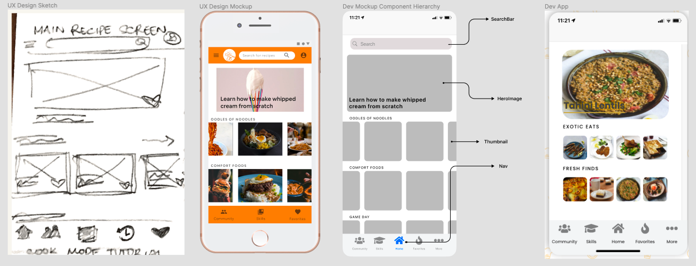
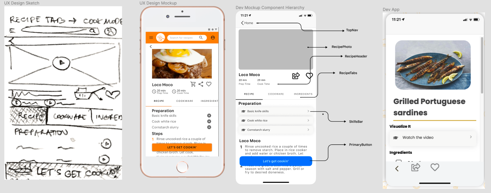

# Savr App

### Project 2 for General Assembly's remote Software Engineering Immersive program

> The Savr App is a single-page React application using third-party API data and React Router for navigation features. This was a former user experience (UX) design project from 2019 that I brought back to life from a developer's perspective. Essentially Savr aims to help at-home chefs come prepared when following a recipe. The awesome folx at [The MealDB](https://www.themealdb.com/api.php/) offer a free API of recipes and options to filter by category, area of origin, and ingredients. 
 

# Screenshots / Lo-Fi to Hi-Fi
### App Demo


### Main Recipe Screen (Design to Dev)


### Recipe Page (Design to Dev)



# Technologies Used

### Organization / Guidance

- Discord
- Slack
- Zoom
- Microsoft OneNote

### Design

- Figma
- Giphy

### Development

- VS Code
- Google Chrome + Developer Tools
- Mozilla Firefox + Developer Tools
- HTML
- CSS: CSS Grid, CSS Flexbox
- JavaScript: React.js, React Router, React Styled-Components

# Getting Started/Installation Instructions

1. Fork and clone this repository.
2. Change into the new directory.
3. Install dependencies ```npm i``` and start the app ```npm run start```

# Contribution Guidelines
The contribution process currently relies on some knowledge of working with Github and writing in Markdown. Here are some resources/helpful links to understand both: 
- [Chaser Pettit's introduction to the GitHub workflow](https://gist.github.com/Chaser324/ce0505fbed06b947d962)
- [Basic Markdown Syntax](https://www.markdownguide.org/basic-syntax/)

Requests to contribute (contribute to your code, identify bugs, and/or propose improvements) can be made via [pull request](https://github.com/kccrtv/savr-app/compare) or [issue](https://github.com/kccrtv/savr-app/issues/new/choose). Thank you!

### References/Credits:
https://www.udemy.com/course/the-complete-web-development-bootcamp/
https://css-tricks.com/text-input-expanding-bottom-border/
https://developer.mozilla.org/en-US/docs/Web/CSS/repeat()
https://developer.mozilla.org/en-US/docs/Web/JavaScript/Reference/Global_Objects/Array/keys
https://developer.mozilla.org/en-US/docs/Web/JavaScript/Reference/Global_Objects/Array/values
https://developer.mozilla.org/en-US/docs/Web/JavaScript/Reference/Global_Objects/Array/includes
https://developer.mozilla.org/en-US/docs/Web/JavaScript/Reference/Global_Objects/Array/entries
https://github.com/styled-components/styled-components/issues/3045
https://www.figma.com/community/file/809487622678629513
https://www.figma.com/community/file/852445385275060830
https://www.figma.com/community/file/891218395377608809
https://www.figma.com/community/file/848318135747364351
https://flaviocopes.com/jsx-return-multiple-elements/
https://fontawesome.com/license
https://www.javascripttutorial.net/object/convert-an-object-to-an-array-in-javascript/
https://www.jquery-az.com/javascript-string-split-tutorial/
https://stackoverflow.com/questions/8683528/embed-image-in-a-button-element
https://stackoverflow.com/questions/32937181/javascript-es6-map-multiple-arrays
https://stackoverflow.com/questions/38824349/how-to-convert-an-object-to-an-array-of-key-value-pairs-in-javascript
https://stackoverflow.com/questions/55840294/how-to-fix-missing-dependency-warning-when-using-useeffect-react-hook
https://www.transparenttextures.com/
https://www.w3schools.com/cssref/css_units.asp
https://www.w3schools.com/howto/tryit.asp?filename=tryhow_css_menu_hor_scroll
https://www.w3schools.com/jsref/jsref_tostring_array.asp
https://www.w3docs.com/snippets/css/how-to-set-the-size-of-a-checkbox-with-html-and-css.html

> Last but not least, the GA Instructors for the SEIR-201 course and my very supportive cohort ("the greatest people you will ever meet")
